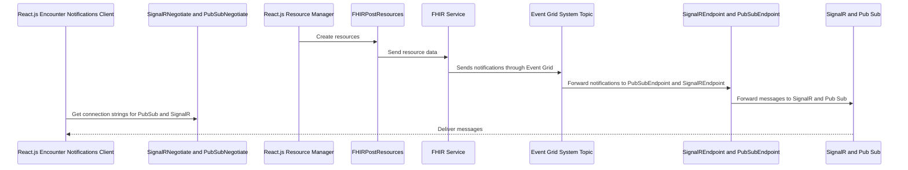

<h1 align="center" id="title">Azure Infrastructure Deployment with Terraform</h1>

This application is part of a prestudy made by Juuso Kärnä and Kasper Heikkinen at Terveystalo starting December 2024.

This repository contains Terraform scripts for deploying Azure-based infrastructure, along with Azure Functions that manage FHIR resources, Pub/Sub messaging, and SignalR connections.

This project is designed to work alongside two React.js applications: the Encounter Notification App and the Resource Manager App. Together, these three repositories form a context management demo aimed at modernizing a legacy health record system.

<li><strong>Encounter notifications:</strong> https://github.com/Kiisshen/FHIR_Encounter_Notifications</li>
<li><strong>Resource manager:</strong> https://github.com/Kiisshen/FHIR_Resource_Manager</li>

<h2>Resources Provisioned</h2>
    <li><strong>Resource Group:</strong> Creates a resource group to contain all Azure resources.</li>
        <li><strong>Key Vault:</strong> Deploys an Azure Key Vault to securely store secrets and access policies.</li>
        <li><strong>App Registration:</strong> Has FHIR Data Contributor role and is used to autheticate FHIR Service usage from Azure Functions.</li>
        <li><strong>Web PubSub:</strong> Provisioning a Web PubSub service for real-time messaging.</li>
        <li><strong>SignalR Service:</strong> Deploying an Azure SignalR service with serverless mode and CORS settings.</li>
        <li><strong>Storage Account:</strong> A general-purpose Azure Storage Account to support function apps and logs.</li>
        <li><strong>Azure Functions:</strong> Deploying a Windows-based Function App with Node.js runtime and application insights.</li>
        <li><strong>Application Insights:</strong> Enabling Application Insights for monitoring the function app performance.</li>
        <li><strong>Log Analytics Workspace:</strong> Provisioning a workspace for centralized logging and monitoring.</li>
        <li><strong>Healthcare APIs:</strong> Deploying a Healthcare FHIR service with authentication and role assignments.</li>
        <li><strong>Event Grid System Topic:</strong> Creating Event Grid subscriptions to handle FHIR resource creation events.</li>
    </ul>

<h2>Functions Provisioned</h2>
        <li><strong>Pub Sub Negotiate:</strong> Provides the client with a connection string to Pub/Sub with client assigned filter.</li>
        <li><strong>Pub Sub Endpoint:</strong> Handles Event Grid handshakes and forwards Event Grid events to Pub/Sub.</li>
        <li><strong>SignalR Negotiate:</strong> Provides clients with a connection string to SignalR.</li>
        <li><strong>FHIR Event Endpoint:</strong> Handles Event Grid handshakes and forwards Event Grid events to SignalR.</li>
        <li><strong>FHIR Post Resources:</strong> Creates FHIR resources in the FHIR service using client-provided payloads</li>
        </ul>

<h2>Prerequisites</h2>
    <ul>
        <li><a href="https://www.terraform.io/downloads.html">Terraform</a></li>
        <li>Azure Functions installed and authenticated (<code>az login</code>)</li>
        <li>Subscription ID and Tenant ID</li>
    </ul>

  <h2>Usage</h2>
    <ol>
        <li><strong>Clone the repository:</strong>
            <pre><code>git clone https://github.com/Kiisshen/ContextManagementTerraform.git</code></pre>
            <pre><code>cd .\ContextManagementTerraform\</code></pre>
        </li>
        <li><strong>Initialize Terraform:</strong>
            <pre><code>terraform init -upgrade</code></pre>
        </li>
        <li><strong>Plan the deployment:</strong>
            <pre><code>terraform plan -out main.tfplan</code></pre>
        </li>
        <li><strong>Apply the deployment:</strong>
            <pre><code>terraform apply main.tfplan</code></pre>
        </li>
        <li>Terraform deployment will fail at this stage because the functions have not yet been deployed, preventing a handshake from being established with HTTP Trigger Azure Functions.
        </li>
         
        <li><strong>Apply functions after terraform failure:</strong>
            <pre><code>func azure functionapp publish contextmanagementfunctionsapp --node</code></pre>
        </li>
        <li><strong>Apply the terraform plan again:</strong>
            <pre><code>terraform plan -out main.tfplan</code></pre>
        </li>
        <li><strong>Apply the terraform deployment again:</strong>
            <pre><code>terraform apply main.tfplan</code></pre>
        </li>
        <li><strong>Destroy the deployment:</strong>
            <pre><code>terraform plan -destroy -out main.tfplandestroy</code></pre>
        </li>
        <li><strong>Destroy the deployment:</strong>
            <pre><code>terraform apply main.tfplandestroy</code></pre>
        </li>
    </ol>
